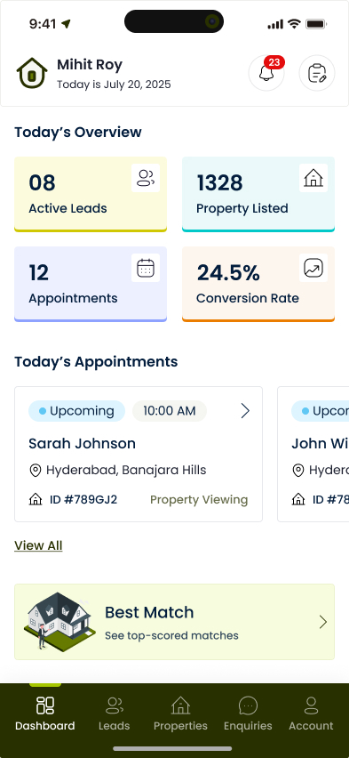
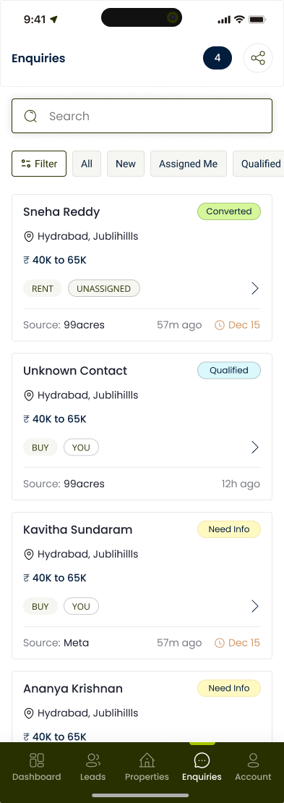
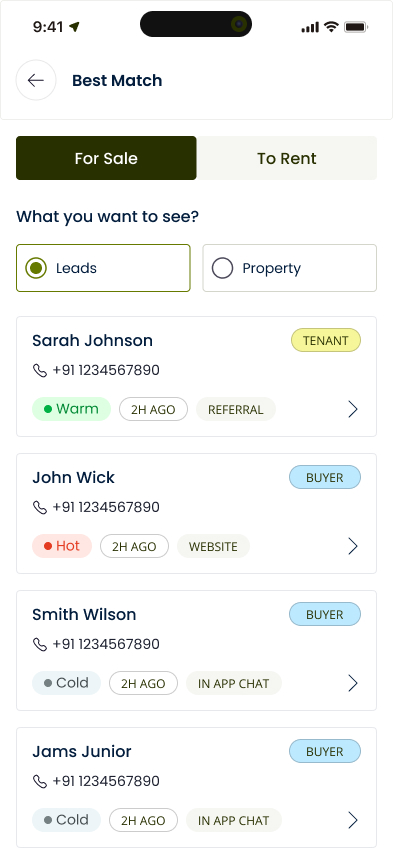
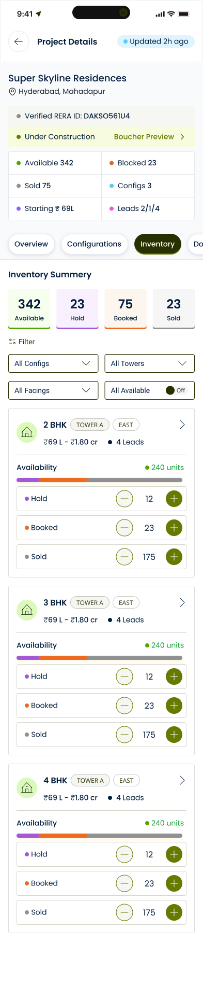
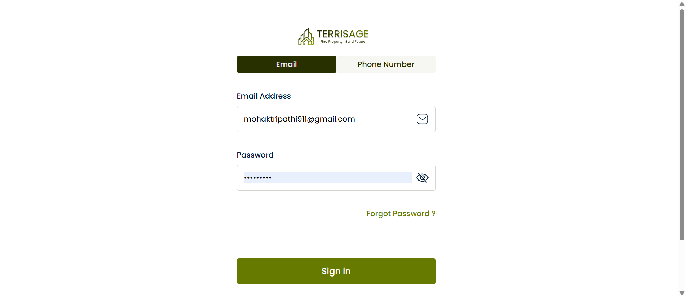
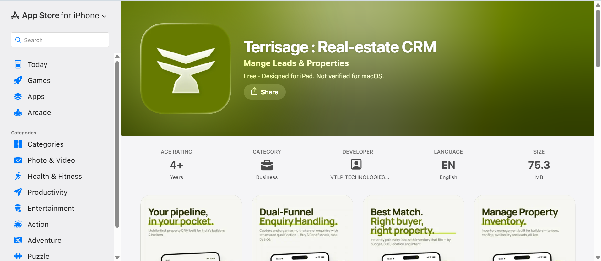
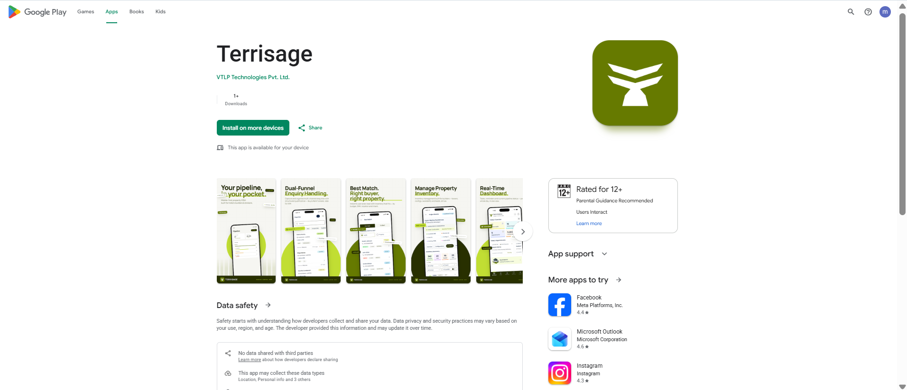
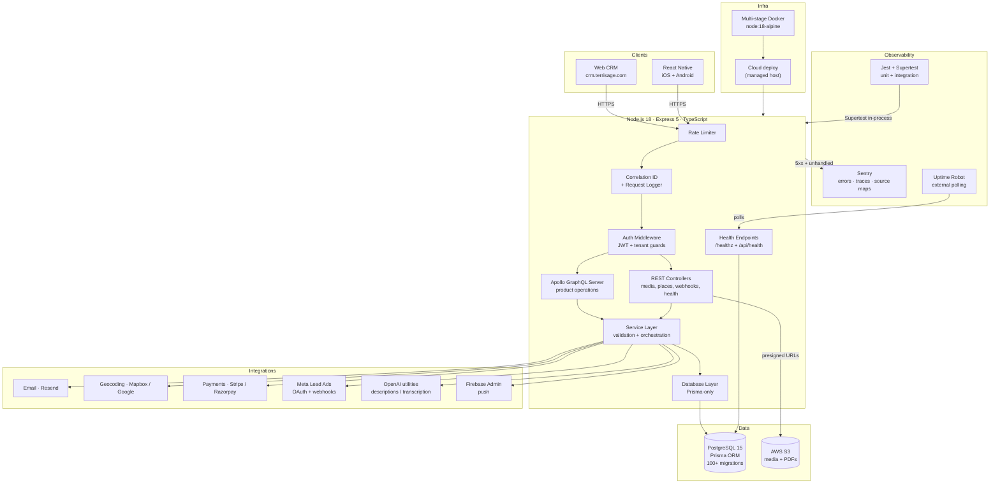

# Terrisage — B2B Real Estate CRM

Production-grade, multi-tenant CRM for real estate teams — lead capture, inventory/properties, builder projects, partner network, tasks, subscription billing, and AI-assisted workflows. **Live on web, iOS, and Android.**

> **About this repository.** The application source code is private (it is a live commercial product). This repository documents the **system architecture, engineering decisions, and production practices** behind Terrisage. It contains no proprietary source code and no customer data — every screenshot uses demo/seeded data.

---

## Live Product

| Surface | Link |
|---------|------|
| Marketing site | https://www.terrisage.com |
| Web CRM (login-gated) | https://crm.terrisage.com/sign-in |
| Android (Google Play) | https://play.google.com/store/apps/details?id=com.terrisage.app.stg |
| iOS (App Store) | https://apps.apple.com/app/id6775200375 |

A single backend serves all three clients (web CRM + React Native iOS/Android) through one GraphQL API.

---

## Screenshots

> All screenshots use demo/seeded data — no real client information.

**Mobile app** — React Native client, live on iOS and Android

| Dashboard | Enquiry Handling | Best Match | Project Config |
|---|---|---|---|
|  |  |  |  |

**Web CRM**

**Published on the App Store and Google Play**

| iOS — App Store | Android — Google Play |
|---|---|
|  |  |

---

## What it does

Terrisage is a purpose-built **Agent CRM** for real estate teams. It organizes enquiries/leads, keeps inventory clean and shareable, drives task execution, and supports collaboration across teams and partner networks — without generic CRM bloat.

| Module | What it covers |
|--------|---------------|
| Lead / Enquiry Management | Capture, qualification, assignment, stages, follow-ups |
| Inventory / Properties | Property records, dynamic fields, media categories, amenities |
| Projects | Builder/developer projects, configurations, brochures, media |
| Best Match | Preference-based buyer ↔ property matching and share workflows |
| Agent Network | Partner/agent collaboration and sharing flows |
| Tasks & Appointments | Reminders, ownership, execution tracking |
| Notifications | Entity-linked notifications and workflow nudges |
| Places / Geocoding | Places search + geocoding (provider-based) |
| Digest / Sharing | Digest links, shareable artifacts, deep links |
| Subscription & Billing | Plan/seat logic, payments, entitlement checks |
| Payments | Stripe + Razorpay integration paths (provider-based) |
| Lead Ingestion | Meta Lead Ads (Page OAuth + webhook), web forms, property portals |

---

## Architecture

---

## Multi-Tenant Architecture

Every record is scoped to a tenant and isolated at the data layer. Auth middleware extracts tenant context from the JWT and injects it into every query, so no operation can read or write across tenant boundaries — enforced in middleware, not left to individual resolvers to remember.

- **Role-based access control (RBAC)** across team and partner-network structures.
- **Scoped data isolation** on every model — tenant context is mandatory, not optional.
- **Thin resolvers, fat services** — authorization and tenant scoping live in one place.

---

## Media & Upload Model (Presigned URLs)

Terrisage follows a **"no binary through GraphQL"** approach:

1. Client requests a **presigned URL** from a REST endpoint.
2. Client uploads directly to S3.
3. GraphQL stores **references/metadata only** (keys, URLs, categories).

This keeps the API stable and scalable while supporting media-heavy workflows — property photos, project brochures, attachments — without streaming binaries through the application layer.

---

## Observability & Production Monitoring

Production reliability is treated as a first-class engineering concern, not an afterthought.

**Error tracking & tracing (Sentry)**

| Layer | What's captured |
|-------|-----------------|
| Bootstrap | Sentry initializes **before** Express loads, so early failures are caught |
| REST | Express error handler captures unhandled errors |
| GraphQL | Apollo `formatError` hook captures unexpected 5xx failures |
| Noise filtering | Expected client errors (401/403, validation, upload limits) are **not** reported — Sentry stays signal, not noise |
| User context | Authenticated user ID attached for debugging, **without PII in logs** |
| Performance | Traces + profiling sampled at 25% |
| Releases | Compiled **source maps uploaded at build time** so production stack traces deobfuscate to real lines |

**Health checks & uptime**

| Endpoint | Purpose | Healthy | Unhealthy |
|----------|---------|---------|-----------|
| `GET /healthz` | Liveness — process is up | `200 ok` | non-200 |
| `GET /api/health` | Readiness — includes DB ping (`SELECT 1`) | `200 { db: connected }` | `503 { db: disconnected }` |

An external monitor (Uptime Robot) polls these endpoints and alerts when the instance or the database path goes unhealthy.

**Request tracing**

Every request carries a **correlation ID** propagated through GraphQL context and REST error responses — so a user report can be matched to a Sentry event and server logs.

---

## Testing (Jest + Supertest)

A **dual-project Jest setup** provides regression protection during heavy iteration.

| | Unit | Integration |
|---|------|-------------|
| Scope | Isolated logic (validators, utils) | Full HTTP path: route → service → **real Postgres** |
| Database | Mocked | Dedicated test database |
| HTTP | — | Supertest against the app in-process |

- **~90 test suites** across auth, lead, inquiry, property, project, task, team management, notifications, channel partner, health, and cron jobs.
- Integration tests **lock API error contracts** — bad input returns `400/401`, never a `500`.
- External services (email, S3, push, OpenAI) are mocked so runs stay deterministic and offline-safe.

> **Reliability formula:** Zod + typed `AppError` + handlers *(mechanism)* → Supertest *(lock known paths)* → Sentry *(catch the unimagined)*.

### Frontend reliability — full test pyramid

The same discipline extends to the React Native client, so every backend outcome surfaces correctly in the UI.

- **Centralized error-handling layer.** One place maps `{ status, errorCode }` → a UI treatment (inline field error, toast, full-screen error, auth redirect, retry prompt). If an error shape isn't mapped, it can't silently disappear. The error response shape is a shared type, so the frontend can't drift from the backend contract.
- **Unit tests (Jest).** The full catalog of backend error shapes is fed into the mapper as inputs — fast, exhaustive, no app launch, no backend.
- **Component / integration tests (React Native Testing Library).** Real screens render with the network mocked at the edge; user input and taps are simulated and the resulting UI state is asserted. Fast and deterministic, with no real device or backend.
- **E2E (Maestro).** Thin — one happy path per critical journey plus one representative case per render category (inline validation, toast, auth redirect, network failure). Proves the wiring holds against a real server on a real device.

---

## Key Engineering Decisions

**GraphQL for product surface; REST for blob workflows.** GraphQL powers typed product operations; REST handles presigned-URL issuance, webhooks, and health so GraphQL stays metadata-only.

**Layered architecture (Schema → Resolvers → Service → Database).** Resolvers stay thin; services orchestrate and validate; the database layer encapsulates Prisma reads/writes and transactions.

**Provider-based integrations.** Payments, geocoding, and external services use provider selection via configuration — swap a provider without touching call sites.

**Docker-first workflow.** A multi-stage build keeps the production image lean (no TypeScript compiler or dev tooling shipped); Makefile targets standardize migrate/deploy/dev.

**Test-driven regression + production observability.** Integration tests lock contracts; Sentry catches production-only failures; health checks + Uptime Robot guard availability.

---

## Tech Stack

| Layer | Technology |
|-------|------------|
| Runtime | Node.js 18 + TypeScript 5 |
| Web framework | Express 5 |
| API | Apollo Server (GraphQL) + REST controllers |
| ORM / DB | Prisma 6 + PostgreSQL 15 |
| Auth | JWT |
| File storage | AWS S3 + presigned URLs |
| Email | Resend |
| Payments | Stripe + Razorpay |
| Geocoding / Places | Mapbox + Google Maps (provider-based) |
| Lead ingestion | Meta Lead Ads (OAuth + webhooks) |
| Scheduling | node-cron |
| Observability | Sentry (errors, traces, profiling, source maps) |
| Uptime | Health endpoints + Uptime Robot |
| Testing | Jest + Supertest (backend), React Native Testing Library, Maestro (mobile E2E) |
| Containerization | Docker (multi-stage) |

---

Built by [Mohak Tripathi](https://linkedin.com/in/mohak-tripathi)